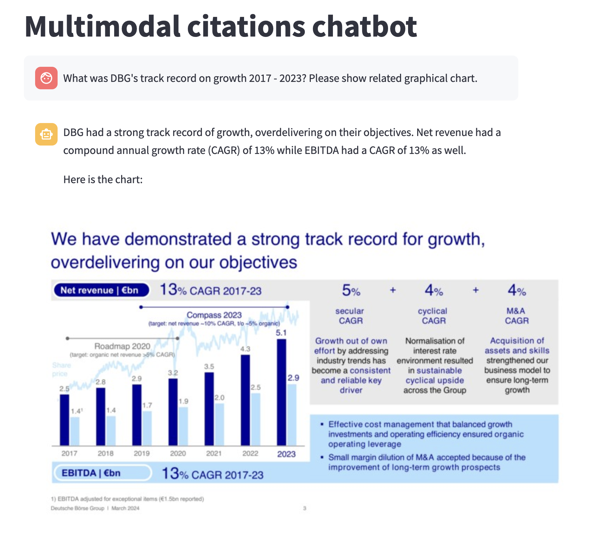
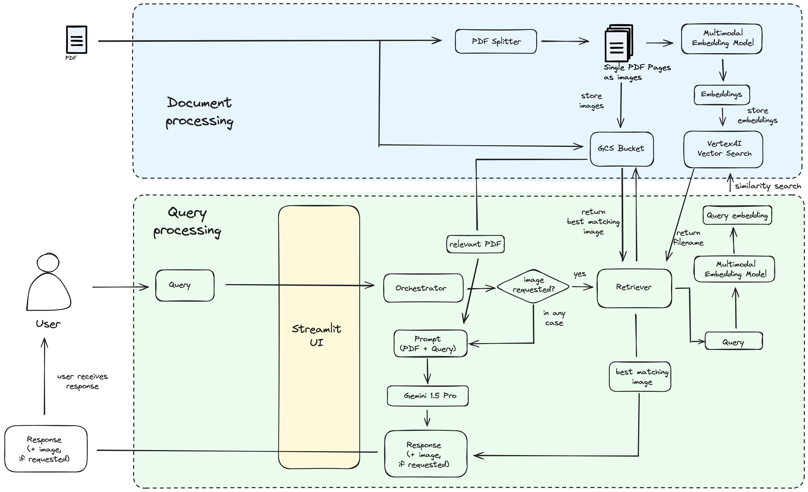

# Multimodal citations with Vertex AI

## Quickstart
Install dependencies:
```
pip install --no-cache-dir -r requirements.txt   
```

To start the streamlit UI, run the follwing command:

```
streamlit run ap.py
```

## Introduction
The example in this repo demonstrates how one could implement multimodal citations (e.g. images, audio snippets, video clips) with Vertex AI.

Multimodal citations are a powerful method to quickly assess whether the response of an LLM is grounded in the actual underlying data. In the example below we ask our chatbot a question about the growth of the German Stock Exchange (Deutsche Börse). You can see that the user also wants to see the related chart. 

By leveraging Gemini 1.5 Pro and the multimodal embedding model, we can fulfil the user's request and display the chart related the the organisation's growth.



## Architecture
Below the architecture for this solution. It consist of two parts:
1. Document processing
2. Chatbot interaction / query processing



### Data processing
Before the user can interact with the chatbot some document processing is required. First, the pdf document itself will be uploaded to Google Cloud Storage (GCS). Then the pdf will be split into individual pages and these will be converted into images and also stored in GCS. Finally, the [multimodal embedding model](https://cloud.google.com/vertex-ai/generative-ai/docs/embeddings/get-multimodal-embeddings) will create embeddings for each page and store them in [Vertex AI Vector Search](https://cloud.google.com/vertex-ai/docs/vector-search/overview?hl=en).


### Chatbot interaction
Once the index endpoint is deployed the application will be able to pull the most relevant image from GCS. To do it will
- Identify if the user wants to see an image (slide, chart, etc)
- If yes, create an embedding for the query
- Finds the image that matches the query the best
- Downloads the corresponding image from GCS
- Displays it in the UI

## Instructions
You can find detailed instructions on how to process your data in [INSTRUCTIONS.md](INSTRUCTIONS.md)

## Data
The data we used for this example is the current investor presentation from the public website of the [Deutsche Börse Group](https://www.deutsche-boerse.com/dbg-en/investor-relations/presentations).

## Ideas for potential improvements
This is a barebone example and there are many ways to build upon it:
- Include other modalities (audio, video)
- UI element in which the user can indicate that they want to see a multimodal citation (might be easier for the user and definitely more reliable for the srchitecture)
- Similarity threshold: Right now the app will always retrieve an image if the user requests one, even if the similarity score is low. It would be better to introduce a threshold value below which no image will be displayed.

